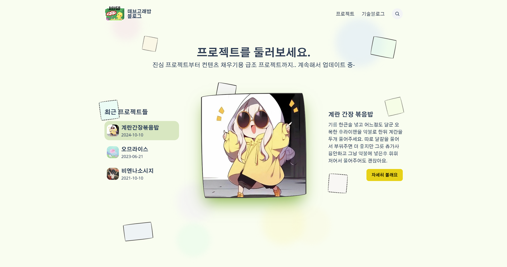
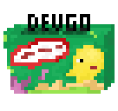

# dev.goraebap

간만에 기술 블로그 살려보기 프로젝트

## 진행사항 (계획)
0. 로고 디자인 - 이게 뭐라고..
1. 디자인, 마크업 - 진행중
2. 기능 구현 (1차: 포스트, 포스트 댓글, 프로젝트)
3. UX 효과 개선
4. 기능 구현 (2차: 구독(필요한가..), )

데모 링크: https://goraebap.xyz

간만에 기술블로그충동이 또 생겨서 몇번째인지 모를 블로그를 제작해보는데.. 이름짓는게 어려워서 github 이름을 그대로 사용했더니 로고를 어떻게 만들어야하는지 답이 안나오는 것이다.

## 로고 디자인

데브 고래밥으로 도대체 어떤 느낌의 로고를 만들어야하나? GPT도 포기한 로고 디자인에 몇시간을 날렸는지 모르겠다. AI로고도 맘에 드는게 하나도 없어서 일러스트레이터, 피그마는 다룰줄 모르기에 간만에 픽셀아트로 끄적거려봤다.

처음엔 고래가 당연히 들어가야함에 고래를 그려놨더니 특색도 없고 뭔가 도커생각이 나서 포기했다.

그래서 만든게 이런 모양이다.([with aseprite](https://www.aseprite.org/))

그냥 들리는 그대로... 기억엔 잘 남지않을까..

만든 당시엔 맘에 들었는데, 시간이 지난 지금 상당히 복잡한 기분이다.