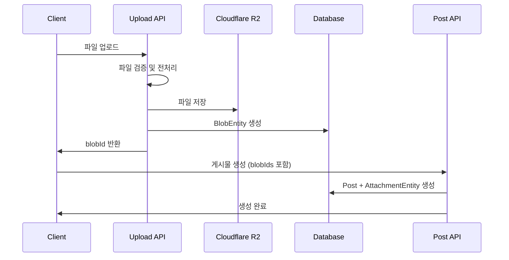
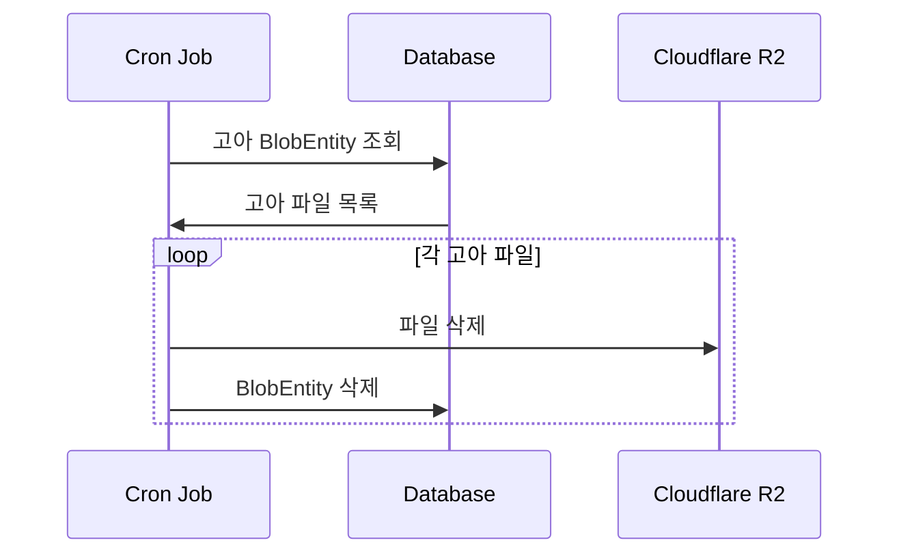

# 파일 업로드 API 아키텍처 설계

## 개요

파일 업로드 기능을 별도 API로 분리하여 멀티파트 데이터 처리의 복잡성을 간소화하고, 파일 재사용성과 고아 파일 관리를 체계적으로 처리하는 설계입니다.

## 엔티티 구조

### BlobEntity (파일 저장소)
- 실제 파일 정보와 메타데이터를 저장
- Cloudflare R2에 저장된 파일과 1:1 매핑
- 여러 도메인에서 재사용 가능

### AttachmentEntity (첨부 관계)
- 파일과 도메인 엔티티 간의 관계를 정의
- `recordType`과 `recordId`로 다양한 도메인 연결 가능
- BlobEntity와 N:1 관계

## 1. 파일 업로드 API 처리 과정

### API 엔드포인트
```
POST /api/admin/file-upload
```

### 처리 단계

#### 1단계: 파일 수신 및 검증
- 멀티파트 파일 수신
- 파일 크기, 타입, 확장자 검증
- 보안 검사 (악성 파일 체크)
- MIME 타입 검증

#### 2단계: 파일 전처리
- 고유한 key 생성 (UUID 또는 해시 기반)
- 파일 체크섬(MD5/SHA256) 계산
- 이미지인 경우 메타데이터 추출 (크기, 해상도 등)
- 파일 경로 생성: `key.substring(0,2)/key.substring(2,4)/key`

#### 3단계: Cloudflare R2 업로드
- 생성된 key로 R2에 파일 저장
- 폴더 구조: `xx/yy/key` (앞 2자리씩 폴더 분산)
- 업로드 실패 시 롤백 처리

#### 4단계: DB 저장
- `BlobEntity`에 파일 정보 저장
- **주의**: `AttachmentEntity`는 아직 생성하지 않음
- 트랜잭션으로 안전성 보장

#### 5단계: 응답 반환
```json
{
  "blobId": 123,
  "key": "abc123def456...",
  "filename": "example.jpg",
  "contentType": "image/jpeg",
  "byteSize": 1024000,
  "url": "https://r2-url/xx/yy/abc123def456...",
  "metadata": {
    "width": 1920,
    "height": 1080
  }
}
```

## 2. 게시물 생성/수정에서의 활용

### 게시물 생성 플로우

1. **클라이언트 측**:
   - 사용자가 파일 선택
   - 각 파일을 업로드 API로 개별 전송
   - 반환받은 `blobId` 배열 수집

2. **게시물 생성 API 호출**:
   ```json
   {
     "title": "게시물 제목",
     "content": "게시물 내용",
     "attachments": [
       {
         "blobId": 123,
         "name": "thumbnail"
       },
       {
         "blobId": 124,
         "name": "document"
       }
     ]
   }
   ```

3. **서버 측 처리**:
   - 게시물 엔티티 생성
   - 각 `blobId`에 대해 `AttachmentEntity` 생성
   - `recordType`: 'post', `recordId`: 새로운 게시물 ID

### 게시물 수정 플로우

1. **기존 첨부파일 분석**:
   - 유지할 파일: 기존 `AttachmentEntity` 유지
   - 삭제할 파일: 해당 `AttachmentEntity` 삭제
   - 새 파일: 새로운 `AttachmentEntity` 생성

2. **처리 로직**:
   ```typescript
   // 기존 첨부파일 삭제
   await AttachmentEntity.delete({
     recordType: 'post',
     recordId: postId,
     blobId: In(deletedBlobIds)
   });

   // 새 첨부파일 추가
   const newAttachments = newBlobIds.map(blobId => ({
     name: 'image',
     recordType: 'post',
     recordId: postId,
     blobId
   }));
   await AttachmentEntity.save(newAttachments);
   ```

## 3. 고아 파일(Orphan Files) 처리 전략

### 고아 파일이 발생하는 경우
- 파일 업로드 후 게시물 생성을 취소
- 게시물에서 파일 삭제
- 게시물 자체를 삭제
- 시스템 오류로 인한 불완전한 처리

### 고아 파일 탐지 쿼리
```typescript
const orphanBlobs = await BlobEntity
  .createQueryBuilder('blob')
  .leftJoin('blob.attachments', 'attachment')
  .where('attachment.id IS NULL')
  .andWhere('blob.createdAt < :date', { 
    date: new Date(Date.now() - 24 * 60 * 60 * 1000) // 24시간 전
  })
  .getMany();
```

### 배치 정리 작업 (Cron Job)
```typescript
@Cron('0 2 * * *') // 매일 새벽 2시 실행
async cleanupOrphanFiles() {
  const orphanBlobs = await this.findOrphanBlobs();
  
  for (const blob of orphanBlobs) {
    try {
      // 1. R2에서 파일 삭제
      await this.r2Service.deleteFile(blob.getFilePath());
      
      // 2. DB에서 BlobEntity 삭제
      await blob.remove();
      
      this.logger.log(`Orphan file deleted: ${blob.key}`);
    } catch (error) {
      this.logger.error(`Failed to delete orphan file: ${blob.key}`, error);
    }
  }
}
```

## 4. 전체 시스템 플로우

### 정상적인 파일 처리 플로우


### 고아 파일 정리 플로우


## 5. 구현 시 고려사항

### 보안
- 파일 타입 및 크기 제한
- 악성 파일 스캔
- 업로드 속도 제한 (Rate Limiting)
- 인증된 사용자만 업로드 허용

### 성능
- 파일 중복 제거 (체크섬 기반)
- 이미지 리사이징 및 최적화
- CDN 캐싱 활용
- 비동기 처리로 응답 시간 최적화

### 에러 처리
- 업로드 실패 시 롤백
- 네트워크 오류 재시도 로직
- 부분 업로드 실패 처리
- 상세한 에러 로깅

### 모니터링
- 업로드 성공률 추적
- 스토리지 사용량 모니터링
- 고아 파일 발생률 추적
- 성능 메트릭 수집

## 6. API 스펙 예시

### 파일 업로드 API
```typescript
@Post('upload')
@UseInterceptors(FileInterceptor('file'))
async uploadFile(@UploadedFile() file: Express.Multer.File) {
  // 구현 로직
}
```

### 게시물 생성 API
```typescript
@Post('posts')
async createPost(@Body() createPostDto: CreatePostDto) {
  // blobIds를 포함한 게시물 생성 로직
}
```

이 설계를 통해 파일 업로드의 복잡성을 분리하고, 재사용 가능하며 유지보수가 용이한 시스템을 구축할 수 있습니다.